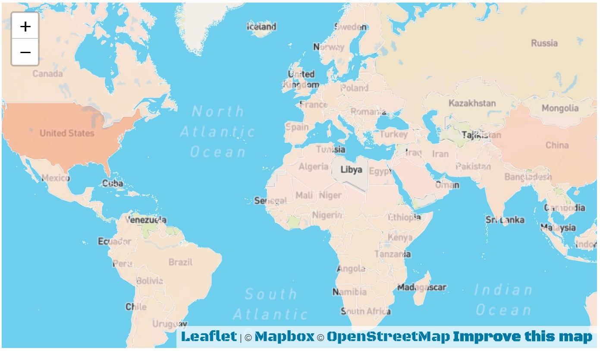
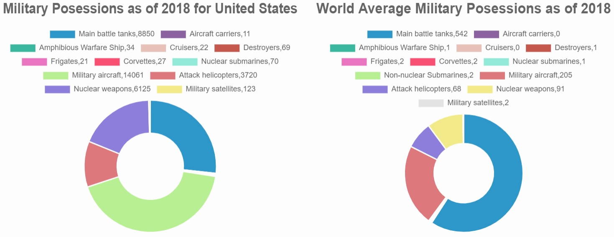

<!DOCTYPE html>
<html>
   <body style = "font-family: Agency FB Regular">

<h1>
Military Spending by Country Total USD Spent and Spend as Percentage of GDP
</h1>
<h2>
Project 2 - Akshita Parasrampuria, Brian Remite, Evan Sims
</h2>

 

<h4>For this project, we will be analyzing military spending among all countries between 1960 and 2018, with an emphasis on United States military conflicts.  We will compare Total Military Spend in USD as well as military spend as a percentage of each country's GDP, and rank each country through each time period by both metrics.</h4>

<h2>
Before You Begin
</h2>

<ol>
    <li>Install "lxml" in your environment using "pip install lxml".</li>
</ol>

 

<h2>
File Structure
</h2>
<h3>root folder</h3>
<ul>
    <li><b>README.md</b> - Our project documentation markdown file.</li>
    <li><b>Project Outline.docx</b> - Our project outline that was submitted for approval at the beginning of the project.</li>
    <li><b>app.py</b> - Our main python application file that calls the Flask application and declares our routes.</li>
</ul>
<h3>"db" folder</h3>
<ul>
    <li><b>military.sqlite</b> - Our SQLite DB that was generated by the db_cleanup.ipynb file, and is used to pull data from.</li>
</ul>
<h3>"notebooks" folder</h3>
<ul>
    <li><b>db_cleanup.ipynb</b> - The Jupyter notebook that we used to read in the two source .csv files from World Bank and create the SQLite DB.</li>
    <li><b>race.ipynb</b> - The Jupyter notebook that we used to clean and shape the data for the bar chart race.</li>
</ul>
<h3>"source" folder</h3>
<ul>
    <li><b>gdp.csv</b> - The source file from World Bank that contains all of the countries' data as a fraction of their GDP for each year.</li>
    <li><b>tms.csv</b> - The source file from World Bank that contains all of the countries' data on total spending in USD for each year.</li>
</ul>
<h3>"static" folder</h3>
<h4>"static/css" folder</h4>
<ul>
    <li><b>BlackOpsOne-Regular.ttf</b> - The TrueType font used throughout our website.</li>
    <li><b>map.css</b> - The CSS file that drives the chloropleth.</li>
    <li><b>style.css</b> - The CSS file that drives our index.html formatting.</li>
</ul>
<h4>"static/images" folder</h4>
<ul>
    <li><b>BarChartGDP.jpg</b> - Screenshot of the bar chart representing spending as a % of GDP on index.html.</li>
    <li><b>BarChartTMS.jpg</b> - Screenshot of the bar chart representing total military spending on index.html.</li>
    <li><b>CountryNames2.png</b> - Screenshot of country names used for mapping.</li>
    <li><b>doughnuts.jpg</b> - Screenshot of two of the doughnut charts on doughnuts.html.</li>
    <li><b>header.jpg</b> - The header image for our README.md.</li>
    <li><b>map.jpg</b> - Screenshot of the chloropleth on index.html.</li>
    <li><b>Thenmap.jpg</b> - Screenshot of the basic chloropleth from the API source.</li>
    <li><b>WBcleaning.jpg</b> - Screenshot of the code used to clean the Thenmap and World Bank data sets.</li>
    <li><b>WBGDP.jpg</b> - Screenshot of the World Bank GDP bar chart.</li>
    <li><b>WBTMS.jpg</b> - Screenshot of the World Bank TMS bar chart.</li>
    <li><b>WikiAfter.png</b> - Screenshot of the Wikipedia data after cleaning.</li>
    <li><b>WikiBefore.png/b> - Screenshot of the Wikipedia data before cleaning.</li>
    <li><b>WikiEquip.jpg</b> - Screenshot of the Wikipedia data for equipment.</li>
    <li><b>WikiPersonnel.jpg</b> - Screenshot of the Wikipedia data for personnel.</li>
</ul>
<h4>"static/js" folder</h4>
<ul>
    <li><b>app.js</b> - The main JS file that runs the charts on the index.html.</li>
    <li><b>config.js</b> - The JS file that contains the API key for the chloropleth.</li>
    <li><b>doughnut.js</b> - The JS file that generates the doughnut charts on doughnuts.html</li>
    <li><b>gdp.js</b> - The JS file that generates the country charts on country.html</li>
    <li><b>map.js</b> - The JS file that generates the chloropleth on index.html</li>
    <li><b>race.js</b> - The JS file that generates the bar chart race on race.html</li>
</ul>
<h3>"templates" folder</h3>
<ul>
    <li><b>cleaning.html</b> - The HTML page that displays images of our data cleansing process for use in the presentation.</li>
    <li><b>country.html</b> - The HTML page that displays a 3-axis bar chart based on data by country for 2018.</li>
    <li><b>doughnuts.html</b> - The HTML page that displays 4 doughnut charts based on data by country for 2018.</li>
    <li><b>index.html</b> - The main HTML file that drives our dashboard.</li>
    <li><b>race.html</b> - The HTML page that displays bar chart race for all data from 1960 through 2018.</li>
    <li><b>sources.html</b> - The HTML page that displays images of our sources sued, with clickable links to each source.  Will be used in our presentation.</li>
</ul>

 

<h2>
Data Structure
</h2>
<h3>Tables</h3>
<ul>
    <li><b>gdp</b> - This table is a list of all countries with their country name, country code, and columns for each year between 1960 and 2018 representing the spending as a percentage of each country's GDP.</li>
        <ul>
            <li><b>name</b> - The name of the country.</li>
            <li><b>code (PK)</b> - The 3-character code given for each country by the World Bank.</li>
            <li><b>1960</b> - The data for the country for the year 1960.</li>
            <li><b>1961</b> - The data for the country for the year 1961.</li>
            <li><b>1962</b> - The data for the country for the year 1962.</li>
            <li><b>1963</b> - The data for the country for the year 1963.</li>
            <li><b>1964</b> - The data for the country for the year 1964.</li>
            <li><b>1965</b> - The data for the country for the year 1965.</li>
            <li><b>1966</b> - The data for the country for the year 1966.</li>
            <li><b>1967</b> - The data for the country for the year 1967.</li>
            <li><b>1968</b> - The data for the country for the year 1968.</li>
            <li><b>1969</b> - The data for the country for the year 1969.</li>
            <li><b>1970</b> - The data for the country for the year 1970.</li>
            <li><b>1971</b> - The data for the country for the year 1971.</li>
            <li><b>1972</b> - The data for the country for the year 1972.</li>
            <li><b>1973</b> - The data for the country for the year 1973.</li>
            <li><b>1974</b> - The data for the country for the year 1974.</li>
            <li><b>1975</b> - The data for the country for the year 1975.</li>
            <li><b>1976</b> - The data for the country for the year 1976.</li>
            <li><b>1977</b> - The data for the country for the year 1977.</li>
            <li><b>1978</b> - The data for the country for the year 1978.</li>
            <li><b>1979</b> - The data for the country for the year 1979.</li>
            <li><b>1980</b> - The data for the country for the year 1980.</li>
            <li><b>1981</b> - The data for the country for the year 1981.</li>
            <li><b>1982</b> - The data for the country for the year 1982.</li>
            <li><b>1983</b> - The data for the country for the year 1983.</li>
            <li><b>1984</b> - The data for the country for the year 1984.</li>
            <li><b>1985</b> - The data for the country for the year 1985.</li>
            <li><b>1986</b> - The data for the country for the year 1986.</li>
            <li><b>1987</b> - The data for the country for the year 1987.</li>
            <li><b>1988</b> - The data for the country for the year 1988.</li>
            <li><b>1989</b> - The data for the country for the year 1989.</li>
            <li><b>1990</b> - The data for the country for the year 1990.</li>
            <li><b>1991</b> - The data for the country for the year 1991.</li>
            <li><b>1992</b> - The data for the country for the year 1992.</li>
            <li><b>1993</b> - The data for the country for the year 1993.</li>
            <li><b>1994</b> - The data for the country for the year 1994.</li>
            <li><b>1995</b> - The data for the country for the year 1995.</li>
            <li><b>1996</b> - The data for the country for the year 1996.</li>
            <li><b>1997</b> - The data for the country for the year 1997.</li>
            <li><b>1998</b> - The data for the country for the year 1998.</li>
            <li><b>1999</b> - The data for the country for the year 1999.</li>
            <li><b>2000</b> - The data for the country for the year 2000.</li>
            <li><b>2001</b> - The data for the country for the year 2001.</li>
            <li><b>2002</b> - The data for the country for the year 2002.</li>
            <li><b>2003</b> - The data for the country for the year 2003.</li>
            <li><b>2004</b> - The data for the country for the year 2004.</li>
            <li><b>2005</b> - The data for the country for the year 2005.</li>
            <li><b>2006</b> - The data for the country for the year 2006.</li>
            <li><b>2007</b> - The data for the country for the year 2007.</li>
            <li><b>2008</b> - The data for the country for the year 2008.</li>
            <li><b>2009</b> - The data for the country for the year 2009.</li>
            <li><b>2010</b> - The data for the country for the year 2010.</li>
            <li><b>2011</b> - The data for the country for the year 2011.</li>
            <li><b>2012</b> - The data for the country for the year 2012.</li>
            <li><b>2013</b> - The data for the country for the year 2013.</li>
            <li><b>2014</b> - The data for the country for the year 2014.</li>
            <li><b>2015</b> - The data for the country for the year 2015.</li>
            <li><b>2016</b> - The data for the country for the year 2016.</li>
            <li><b>2017</b> - The data for the country for the year 2017.</li>
            <li><b>2018</b> - The data for the country for the year 2018.</li>
        </ul> 
    <li><b>tms</b> - This table is a list of all countries with their country name, country code, and columns for each year between 1960 and 2018 representing the total military spending in USD.</li>
        <ul>
            <li><b>name</b> - The name of the country.</li>
            <li><b>code (PK)</b> - The 3-character code given for each country by the World Bank.</li>
            <li><b>1960</b> - The data for the country for the year 1960.</li>
            <li><b>1961</b> - The data for the country for the year 1961.</li>
            <li><b>1962</b> - The data for the country for the year 1962.</li>
            <li><b>1963</b> - The data for the country for the year 1963.</li>
            <li><b>1964</b> - The data for the country for the year 1964.</li>
            <li><b>1965</b> - The data for the country for the year 1965.</li>
            <li><b>1966</b> - The data for the country for the year 1966.</li>
            <li><b>1967</b> - The data for the country for the year 1967.</li>
            <li><b>1968</b> - The data for the country for the year 1968.</li>
            <li><b>1969</b> - The data for the country for the year 1969.</li>
            <li><b>1970</b> - The data for the country for the year 1970.</li>
            <li><b>1971</b> - The data for the country for the year 1971.</li>
            <li><b>1972</b> - The data for the country for the year 1972.</li>
            <li><b>1973</b> - The data for the country for the year 1973.</li>
            <li><b>1974</b> - The data for the country for the year 1974.</li>
            <li><b>1975</b> - The data for the country for the year 1975.</li>
            <li><b>1976</b> - The data for the country for the year 1976.</li>
            <li><b>1977</b> - The data for the country for the year 1977.</li>
            <li><b>1978</b> - The data for the country for the year 1978.</li>
            <li><b>1979</b> - The data for the country for the year 1979.</li>
            <li><b>1980</b> - The data for the country for the year 1980.</li>
            <li><b>1981</b> - The data for the country for the year 1981.</li>
            <li><b>1982</b> - The data for the country for the year 1982.</li>
            <li><b>1983</b> - The data for the country for the year 1983.</li>
            <li><b>1984</b> - The data for the country for the year 1984.</li>
            <li><b>1985</b> - The data for the country for the year 1985.</li>
            <li><b>1986</b> - The data for the country for the year 1986.</li>
            <li><b>1987</b> - The data for the country for the year 1987.</li>
            <li><b>1988</b> - The data for the country for the year 1988.</li>
            <li><b>1989</b> - The data for the country for the year 1989.</li>
            <li><b>1990</b> - The data for the country for the year 1990.</li>
            <li><b>1991</b> - The data for the country for the year 1991.</li>
            <li><b>1992</b> - The data for the country for the year 1992.</li>
            <li><b>1993</b> - The data for the country for the year 1993.</li>
            <li><b>1994</b> - The data for the country for the year 1994.</li>
            <li><b>1995</b> - The data for the country for the year 1995.</li>
            <li><b>1996</b> - The data for the country for the year 1996.</li>
            <li><b>1997</b> - The data for the country for the year 1997.</li>
            <li><b>1998</b> - The data for the country for the year 1998.</li>
            <li><b>1999</b> - The data for the country for the year 1999.</li>
            <li><b>2000</b> - The data for the country for the year 2000.</li>
            <li><b>2001</b> - The data for the country for the year 2001.</li>
            <li><b>2002</b> - The data for the country for the year 2002.</li>
            <li><b>2003</b> - The data for the country for the year 2003.</li>
            <li><b>2004</b> - The data for the country for the year 2004.</li>
            <li><b>2005</b> - The data for the country for the year 2005.</li>
            <li><b>2006</b> - The data for the country for the year 2006.</li>
            <li><b>2007</b> - The data for the country for the year 2007.</li>
            <li><b>2008</b> - The data for the country for the year 2008.</li>
            <li><b>2009</b> - The data for the country for the year 2009.</li>
            <li><b>2010</b> - The data for the country for the year 2010.</li>
            <li><b>2011</b> - The data for the country for the year 2011.</li>
            <li><b>2012</b> - The data for the country for the year 2012.</li>
            <li><b>2013</b> - The data for the country for the year 2013.</li>
            <li><b>2014</b> - The data for the country for the year 2014.</li>
            <li><b>2015</b> - The data for the country for the year 2015.</li>
            <li><b>2016</b> - The data for the country for the year 2016.</li>
            <li><b>2017</b> - The data for the country for the year 2017.</li>
            <li><b>2018</b> - The data for the country for the year 2018.</li>
        </ul>
</ul>
 

<h2>
Charts
</h2>
<h3>
Bar Charts
</h3>
<h3>
GDP
</h3>

 
<h3>
TMS
</h3>

 
<h3>
Chloropleth
</h3>

 
<h3>
Doughnut Charts
</h3>

 
 

<h2>
Sources
</h2>
<ul>
    <li><a href="https://data.worldbank.org/indicator/MS.MIL.XPND.CD?year_high_desc=true">The World Bank - Military expenditure (current USD)</a></li>
    <li><a href="https://data.worldbank.org/indicator/NY.GDP.MKTP.CD?year_high_desc=true">The World Bank - GDP (current US$)</a></li>
    <li><a href="http://api.thenmap.net/doc/v2/">Thenmap API V2</a></li>
    <li><a href="https://en.wikipedia.org/wiki/List_of_countries_by_level_of_military_equipment">Wikipedia - List of Countries by Level of Military Equipment</li>
    <li><a href="https://en.wikipedia.org/wiki/List_of_countries_by_number_of_military_and_paramilitary_personnel">Wikipedia - List of Countries by Number of Military and Paramilitary Personnel</a></li>
</ul>
</body>
</html>